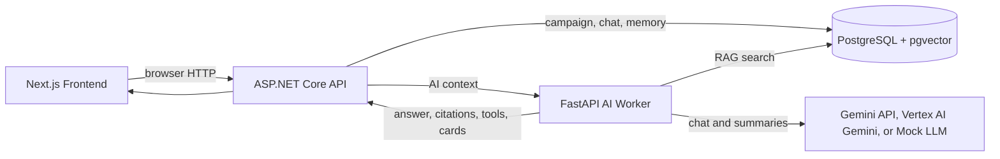

# DNDMind — AI Dungeon Master Co-Pilot

An AI-powered Dungeon Master command center for tabletop RPG campaigns, built to demonstrate full-stack LLM application engineering.

DNDMind is a mock-first full-stack AI product for running and reviewing long-lived tabletop campaigns. It combines campaign data, campaign knowledge retrieval, session memory, structured AI outputs, deterministic tools, domain-scoped chat behavior, and evaluation workflows in one local Docker Compose demo.

## Problem

Dungeon Masters need to manage rules, campaign continuity, party context, session memory, NPCs, quests, encounters, dice rolls, and summaries across long-running campaigns. That context is usually scattered across notes, books, chat logs, and improvised table decisions.

## Solution

DNDMind combines Campaign Knowledge RAG, campaign memory, campaign lifecycle controls, guarded response tone, structured output, context-aware tool calling, scope guarding, and deterministic evals into one command-center interface. The default path uses `MOCK_LLM=true` and `MOCK_EMBEDDINGS=true`, so the project can be reviewed locally without paid API usage or external model calls.

## Architecture



The frontend renders the DM command center, Campaign menu, Campaign Knowledge library, downloadable templates, and local browser profile header for browser-owned sessions. The API owns campaign lifecycle, party management, upload validation, chat persistence, memory writes, demo seed hydration, and worker proxying. The AI worker handles prompt orchestration, guarded campaign tone, scope guarding, upload sanitization, RAG, structured output, context-aware tool execution, and mock, Gemini API-key, or Vertex AI provider calls. PostgreSQL stores campaign entities, archive state, messages, memory, knowledge chunks, party history, and pgvector embeddings.

## Key Features

- Campaign create/edit/archive/restore management
- Party management
- AI command center chat
- Guarded campaign response tone
- Campaign Knowledge library with `.txt` and `.md` templates
- Rules and Homebrew RAG with citations
- Campaign memory RAG, including saved encounters
- Session notes and summarization
- Tabletop RPG scope guard with helpful redirect actions
- NPC, quest, location, encounter, dice roll, and initiative structured cards
- Context-aware tool calling with persisted traces
- Dice roller
- Encounter difficulty calculator
- Session Prep summary
- Docker Compose local deployment
- Mock LLM mode for demo without API usage

## AI Engineering Concepts Demonstrated

- RAG
- Embeddings
- pgvector
- Vector search
- Prompt orchestration
- Multi-provider chat routing
- Guarded style hints
- Upload validation and sanitization
- Structured output
- Tool/function calling
- Long-term memory
- Deterministic evaluation
- Hallucination and out-of-scope resistance checks
- Multi-service Docker architecture

## Tech Stack

| Layer | Technology |
| --- | --- |
| Frontend | Next.js, React, Tailwind CSS |
| Backend API | ASP.NET Core 8 Web API, Npgsql |
| AI Worker | Python, FastAPI, Pydantic |
| Database | PostgreSQL 16, pgvector |
| LLM | Mock LLM mode by default, Gemini API-key and Vertex AI Gemini provider support |
| Deployment | Docker Compose |

## Screenshots

Screenshot placeholders are reserved for a local demo capture:

- `docs/screenshots/01-command-center.png` - command center overview
- `docs/screenshots/02-encounter-card.png` - structured encounter output
- `docs/screenshots/03-rules-rag-citations.png` - rules answer with citations
- `docs/screenshots/04-session-prep.png` - session prep summary

The files are not committed yet. Add them after running the app locally and capturing the current UI.

## Quick Start

Prerequisites:

- Docker Desktop or Docker Engine with Compose
- Optional local tooling: .NET 8 SDK, Node.js 20, Python 3.12

```bash
cp .env.example .env
docker compose up --build
```

Open:

- Frontend: `http://localhost:3000`
- API health: `http://localhost:8080/api/health`
- AI worker health: `http://localhost:8001/health`

## Environment Variables

`.env.example` contains safe local placeholders only. Copy it to `.env` for local development and keep `.env` out of Git.

| Variable | Purpose |
| --- | --- |
| `MOCK_LLM=true` | Enables deterministic local chat responses without paid API calls. |
| `MOCK_EMBEDDINGS=true` | Enables deterministic local embeddings for demo RAG flows. |
| `LLM_PROVIDER` | Real AI provider when `MOCK_LLM=false`; supports `gemini` or `vertex`. |
| `GEMINI_API_KEY` | Gemini API key for `LLM_PROVIDER=gemini`; keep empty for mock or Vertex mode. |
| `GEMINI_MODEL` | Gemini chat model, defaulting to `gemini-2.5-flash`. |
| `VERTEX_PROJECT_ID` | Google Cloud project ID for `LLM_PROVIDER=vertex`. |
| `VERTEX_LOCATION` | Vertex AI location, defaulting to `global`. |
| `VERTEX_MODEL` | Vertex Gemini model, defaulting to `gemini-2.5-flash`. |
| `GOOGLE_APPLICATION_CREDENTIALS` | Optional in-container ADC credential path for local Docker Vertex mode. |
| `CHAT_MODEL` | Backward-compatible chat model fallback when `GEMINI_MODEL` is not set. |
| `EMBEDDING_PROVIDER` | Real embedding provider when `MOCK_EMBEDDINGS=false`; supports `gemini` or `openai`. |
| `GEMINI_EMBEDDING_MODEL` | Gemini embedding model, defaulting to `gemini-embedding-001`. |
| `GEMINI_EMBEDDING_DIMENSIONS` | Gemini embedding output size. Keep `1536` unless the pgvector schema changes. |
| `OPENAI_API_KEY` | Optional OpenAI embedding key if `EMBEDDING_PROVIDER=openai`. |
| `EMBEDDING_MODEL` | OpenAI embedding model name, or readable alias for the active embedding model. |
| `DATABASE_URL` | Worker PostgreSQL connection string. |
| `AI_WORKER_URL` | API-to-worker URL, defaulting to `http://ai-worker:8001`. |
| `NEXT_PUBLIC_API_URL` | Browser-visible API URL alias. |
| `NEXT_PUBLIC_API_BASE_URL` | Browser-visible API base URL used by the current frontend. |

To use Gemini API-key mode instead of mock responses, copy `.env.example` to `.env`, set `MOCK_LLM=false`, set `LLM_PROVIDER=gemini`, and put your key in `GEMINI_API_KEY`.

To use Vertex AI Gemini through Application Default Credentials, set `MOCK_LLM=false`, `LLM_PROVIDER=vertex`, `VERTEX_PROJECT_ID=project-de842900-cb0b-4155-b9c`, `VERTEX_LOCATION=global`, and `VERTEX_MODEL=gemini-2.5-flash`. For local Docker usage, make ADC available inside the `ai-worker` container by mounting your gcloud ADC JSON file and setting `GOOGLE_APPLICATION_CREDENTIALS` to the mounted path, such as `/gcloud/application_default_credentials.json`. Keep `MOCK_EMBEDDINGS=true` for the first Vertex chat pass unless you intentionally wire a real embedding provider.

To make RAG use Gemini embeddings too, set `MOCK_EMBEDDINGS=false` and `EMBEDDING_PROVIDER=gemini`. Gemini embeddings are requested at 1536 dimensions to match the current `knowledge_chunks.embedding vector(1536)` schema.

## Demo Flow

1. Open `http://localhost:3000`.
2. Create, restore, or select a campaign.
3. Add or review party members.
4. Add sample rules from `db/seed/srd_sample.md` to Campaign Knowledge.
5. Ask a rules question such as `How does advantage work?`
6. Review the answer and its citations.
7. Paste session notes from `db/seed/session_notes.md`.
8. Save and summarize the session.
9. Generate an NPC.
10. Create and save an encounter so it becomes campaign memory.
11. Roll dice from the command center.
12. Review Session Prep for open hooks, quests, and usable knowledge.

For a guided walkthrough, open the in-app manual at `http://localhost:3000/manual` or read `docs/user-manual.md`.

## Local Browser Profiles

DNDMind does not require login for the MVP. The browser creates an anonymous local profile ID in `localStorage` and sends it as `X-Dndmind-Client-Id`. Campaigns and rules documents stay shared, but sessions and session-derived campaign memory are private to the current browser profile.

Clearing browser storage or resetting the local profile creates a new identity, so previous local sessions may no longer appear. This is demo ownership, not production authentication.

## Evaluation

DNDMind is designed for deterministic evaluation in mock mode. The sample eval cases check:

- Rules accuracy
- Homebrew isolation from rules retrieval
- Citation correctness
- Campaign memory recall
- Campaign tone stays style-only and does not override scope or grounding
- JSON validity
- Context-toggle and tool-calling correctness
- Hallucination and out-of-scope resistance
- Encounter fallback, save, and memory correctness

This makes the project easier to review because AI behavior can be checked repeatedly without model drift or external API cost. See `docs/eval-design.md` for the evaluation plan.

## Portfolio Positioning

DNDMind is more than a chatbot. It demonstrates a product UI, an AI worker, RAG, memory, deterministic tools, structured cards, evals, and Dockerized full-stack architecture. The project shows how LLM features fit into a real application with service boundaries, persistence, local development ergonomics, and reviewer-friendly demo flows.

## Developer Commands

Run the full stack:

```bash
docker compose up --build
```

Worker tests:

```bash
docker compose exec ai-worker python -m unittest discover -s tests
```

API build:

```bash
dotnet build apps/api/DNDMind.Api.csproj
```

Frontend build:

```bash
cd apps/web
npm run build
```

## Roadmap

- Multi-provider LLM routing
- Local Ollama fallback
- Voice session notes
- Advanced combat tracker
- Campaign memory graph
- LLM-as-judge evals
- Fine-tuning dataset exporter
- VPS deployment
