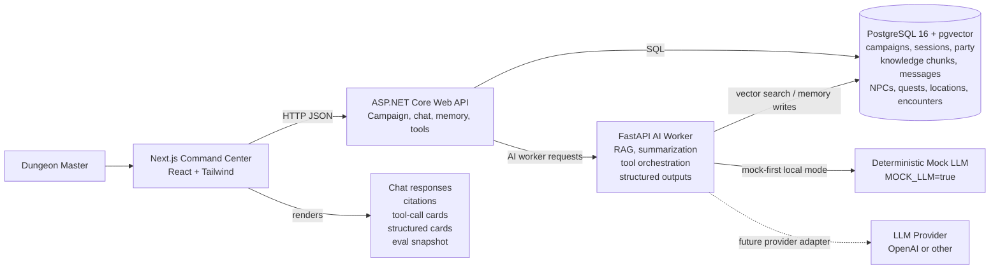
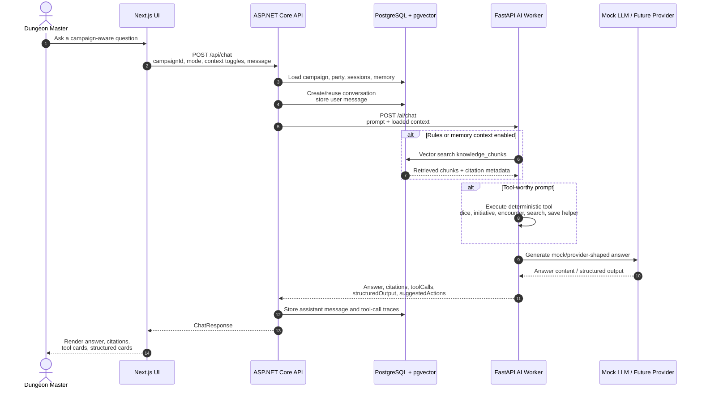

# DNDMind - AI Dungeon Master Co-Pilot

An AI-powered campaign command center for tabletop RPG Dungeon Masters, built to demonstrate full-stack LLM application engineering.

DNDMind helps a Dungeon Master manage rules, campaign continuity, party context, session memory, NPCs, quests, encounters, and evaluation workflows across a long-running tabletop campaign. It is intentionally more than a chatbot: the app combines RAG, campaign memory, structured output, tool calling, deterministic eval design, and a Dockerized multi-service architecture.

## Problem

Dungeon Masters juggle rules references, session notes, NPC relationships, unresolved hooks, party stats, and encounter prep while trying to keep the table moving. Long campaigns make this harder because important continuity details are scattered across notes and memory.

## Solution

DNDMind centralizes that context in a command-center interface. The Next.js UI sends campaign-aware requests to an ASP.NET Core API, which persists campaign data in PostgreSQL and delegates AI-shaped work to a FastAPI worker. Local demos run in deterministic mock mode, so reviewers can see RAG, tool calls, memory, and structured cards without needing a paid LLM key.

## Architecture

### System Chart



### Chat and RAG Sequence



## Features

- Campaign management
- Party management
- AI chat command center
- Rules RAG with citations
- Campaign memory RAG
- Session summarization
- NPC, quest, location, and encounter structured cards
- Tool calling with persisted traces
- Dice roller
- Initiative generation
- Encounter difficulty calculator
- Evaluation dashboard design and sample eval cases
- Docker Compose deployment
- Mock LLM mode for local demos

## AI Engineering Concepts Demonstrated

- Retrieval augmented generation
- Embeddings and vector search
- PostgreSQL + pgvector knowledge storage
- Prompt orchestration boundaries
- Structured output rendering
- Tool and function calling
- Long-term campaign memory
- Deterministic eval design
- Hallucination resistance checks through citations and expected facts
- Dockerized multi-service architecture

## Tech Stack

| Layer | Technology |
| --- | --- |
| Frontend | Next.js, React, Tailwind CSS |
| Backend API | ASP.NET Core 8, Npgsql |
| AI Worker | Python, FastAPI, Pydantic |
| Database | PostgreSQL 16, pgvector |
| LLM path | Mock-first local mode, future OpenAI/provider adapter |
| Deployment | Docker Compose |

## Quick Start

Prerequisites:

- Docker Desktop or Docker Engine with Compose
- Optional for local-only checks: .NET 8 SDK, Node.js 20, Python 3.12

Copy the sample environment file:

```bash
cp .env.example .env
```

Run the full stack:

```bash
docker compose up --build
```

Open the app:

- Web UI: `http://localhost:3000`
- API health: `http://localhost:8080/api/health`
- AI worker health: `http://localhost:8001/health`
- Postgres: `localhost:5432`

Default mode is safe for demos:

- `MOCK_LLM=true` returns deterministic AI-shaped responses.
- `MOCK_EMBEDDINGS=true` creates deterministic local embeddings.
- `OPENAI_API_KEY` can stay empty.

## Demo Flow

Use the seeded campaign, `Shadows of Eldermire`, or create a new campaign from the API later.

1. Open `http://localhost:3000`.
2. Confirm the sample party appears in the right panel.
3. Open `db/seed/srd_sample.md`, paste it into the Rules Documents panel, and click `Upload + Ingest`.
4. Ask: `How does advantage work?`
5. Paste the sample notes from `db/seed/session_notes.md` into Session Notes.
6. Click `Save`, then `Summarize`.
7. Ask: `Who betrayed the party last session?`
8. Ask: `Generate a suspicious tavern keeper NPC.`
9. Click the suggested save action on the structured NPC card.
10. Ask: `Generate a hard forest ambush encounter for my party.`
11. Roll `1d20+5` in the dice roller.
12. Review the evaluation snapshot in the UI and the cases in `db/seed/eval_cases.json`.

## Screenshots

Add screenshots after a local demo run:

- `docs/screenshots/01-command-center.png`
- `docs/screenshots/02-rules-rag-citations.png`
- `docs/screenshots/03-structured-npc-card.png`
- `docs/screenshots/04-eval-dashboard.png`

## Evaluation

DNDMind uses a deterministic eval strategy for portfolio review: fixed prompts, expected facts, required citations or tool calls, and mock-mode responses that are stable across machines. The current sample cases live in `db/seed/eval_cases.json` and cover:

- rules retrieval with citations
- campaign memory recall
- dice/tool execution
- structured NPC output
- encounter difficulty/tool behavior

The intended next step is a small eval runner that calls the API, checks expected strings and citations, and records pass/fail results for the dashboard. See `docs/eval-design.md`.

## Developer Commands

If `make` is available:

```bash
make up
make down
make logs
make reset-db
make test
make evals
```

Windows users without `make` can run the equivalent Docker commands directly:

```bash
docker compose up --build
docker compose down
docker compose logs -f
docker compose down -v
docker compose exec ai-worker python -m unittest discover -s tests
```

Local checks:

```bash
dotnet build apps/api/DNDMind.Api.csproj
cd apps/web && npm run build
cd apps/ai-worker && python -m unittest discover -s tests
```

## Health Checks

- Frontend: open `http://localhost:3000`
- API: open `http://localhost:8080/api/health`
- AI worker: open `http://localhost:8001/health`
- Database: `docker compose exec postgres pg_isready -U dndmind -d dndmind`

## Demo Data

The database initializes through `db/init.sql` with:

- sample campaign: `Shadows of Eldermire`
- sample party characters
- sample session notes around an NPC betrayal
- starter NPC, quest, location, and memory hook data

Additional demo files:

- sample rules document: `db/seed/srd_sample.md`
- sample session notes: `db/seed/session_notes.md`
- sample eval cases: `db/seed/eval_cases.json`

Reset the local database:

```bash
docker compose down -v
docker compose up --build
```

## Deployment Notes

Docker Compose is the supported local deployment path. For a small VPS deployment, run the same services behind a reverse proxy such as Caddy, Nginx, or Traefik, terminate TLS at the proxy, keep Postgres on a private network, and provide real secrets through server-managed environment variables.

Do not commit real API keys. Keep `.env` local and use `.env.example` only for safe defaults.

## Portfolio Positioning

DNDMind demonstrates practical AI product engineering, not only prompt writing. It shows how to shape an LLM feature into a real application with persistent state, service boundaries, deterministic local behavior, retrieval, structured data, tool traces, and reviewer-friendly documentation.

This makes it suitable for GitHub, LinkedIn, and Upwork as evidence of:

- full-stack product implementation
- AI workflow design
- RAG and vector database fundamentals
- backend orchestration
- frontend UX for AI outputs
- Docker-based deployment readiness

## Roadmap

- Multi-provider LLM routing
- Local Ollama fallback
- Voice session notes
- Advanced combat tracker
- Campaign memory graph
- LLM-as-judge evals
- Fine-tuning dataset exporter
