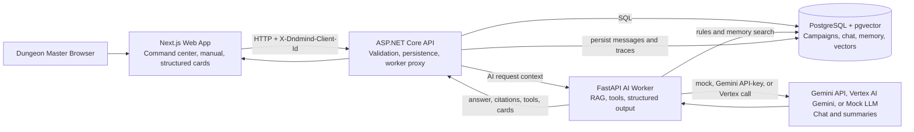

# Architecture

DNDMind is organized as a small multi-service AI product. The architecture keeps product data, AI orchestration, and user experience separate enough to be understandable without becoming over-engineered.

## Components



```text
Next.js Frontend
  command center UI
  campaign create, edit, archive, and restore controls
  Campaign Knowledge upload and template UI
  session notes workflow
  structured cards
  tool-call display
  session prep summary

ASP.NET Core API
  public HTTP boundary for the browser
  campaign, party, session, memory, and document endpoints
  campaign archive filtering and restore flow
  demo seed hydration per browser client owner
  document upload validation and filename normalization
  conversation/message/tool-call persistence
  request assembly for the AI worker

FastAPI AI Worker
  mock-first LLM behavior with Gemini API-key and Vertex AI real-chat modes
  guarded campaign response tone as style-only prompt context
  tabletop RPG scope guard and redirect suggestions
  upload sanitization before document chunking and embedding
  rules, homebrew, and campaign memory retrieval
  session summary extraction
  context-toggle-aware deterministic tool execution
  structured output shaping

PostgreSQL + pgvector
  campaign source of truth
  relational memory tables
  knowledge documents and vector chunks
  conversation and tool-call audit trail
```

## Request Flow

1. The DM uses the Next.js command center to select context toggles, mode, and a prompt.
2. The frontend posts to the ASP.NET Core API.
3. The API loads campaign, party, and session context from PostgreSQL.
4. The API creates or reuses an AI conversation and stores the user message.
5. The API calls the FastAPI worker with the full request context.
6. The worker rejects clearly out-of-scope prompts before model generation, then plans tools based on the prompt intent, selected mode, and enabled context toggles.
7. The worker returns an answer, citations, tool calls, structured output, and suggested actions.
8. The API stores the assistant message and tool-call traces. Saved encounters also create campaign-memory documents for later retrieval.
9. The frontend renders normal text, citations, tool cards, and structured cards.

## Why ASP.NET Core + FastAPI

The ASP.NET Core API is the durable application backend. It owns validation, persistence, browser-facing routes, and stable product contracts.

The FastAPI worker owns AI-facing behavior. Python keeps RAG, embeddings, tool orchestration, and model-provider integrations close to the ecosystem where those tools are strongest.

This split is useful for a portfolio project because it demonstrates a realistic production boundary: the product API can remain stable while AI behavior evolves behind a worker contract.

## Trade-Offs

- Two backend services add Docker and networking overhead, but make AI iteration cleaner.
- Mock embeddings are not semantically equivalent to real embeddings, but they make local demos deterministic and free. Gemini embeddings can be enabled at 1536 dimensions to match the current pgvector schema.
- The current worker has a mock-first provider path plus Gemini API-key and Vertex AI chat modes; deterministic mock mode remains the safest portfolio demo path.
- Vertex AI mode uses Application Default Credentials through `google-auth`, so local Docker setups must mount ADC credentials into the worker container without committing them.
- The scope guard is intentionally lightweight and deterministic. It keeps obvious unrelated prompts out of the product path, but it is not a full safety classifier.
- Campaign response tone is a style hint only; the worker prompt explicitly keeps scope, grounding, citations, tool results, and structured-output requirements higher priority.
- Campaign archive is soft state (`archived_at`), so normal campaign lists stay tidy without deleting data.
- Demo memory is copied per browser client owner on first access to preserve local profile isolation while keeping the seeded walkthrough useful.
- Uploaded Campaign Knowledge is capped and sanitized as plain text before chunking so indexing remains bounded and safe for local demos.
- Rules and Homebrew retrieval are intentionally separate, so custom table mechanics only affect answers when Homebrew context is enabled.
- PostgreSQL + pgvector keeps the stack simple compared with a separate vector database, but large-scale retrieval would eventually need more tuning.
- The sample eval cases and unit tests cover the deterministic quality layer; a full automated eval runner is a clear next step.

## Data Model Highlights

- `campaigns`, `sessions`, and `party_characters` hold campaign setup, archive state, and party context.
- `knowledge_documents` and `knowledge_chunks` store rules, homebrew, and memory RAG content.
- `ai_conversations`, `ai_messages`, and `ai_tool_calls` preserve AI interactions.
- `npcs`, `quests`, `locations`, `encounters`, and `memory_events` turn session notes and structured outputs into reusable campaign memory.
